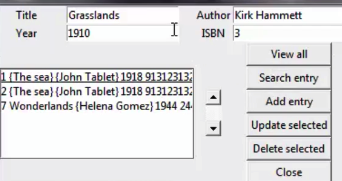

[](https://www.python.org/)
[](https://github.com/psf/black)
[](LICENSE.md)

# Book inventory

> Simple book inventory desktop app based on `tkinter` and `sqlite`.

## Tools

- python 3.7+
- [tkinter](https://docs.python.org/3/library/tkinter.html) 
- [sqlite](https://www.sqlite.org/index.html)
- [black](https://black.readthedocs.io/en/stable/)

## Usage



## Installation

> Make sure `python-tk` system package is installed e.g via `brew install python-tk`

```bash
git clone git@github.com:vyahello/book-inventory.git
cd book-inventory
python3 -m venv venv 
. venv/bin/activate
pip install -r requirements.txt
python app.py
```

Open tkinter app.

**[⬆ back to top](#book-inventory)**

## Development notes

### Meta

Author – _Vladimir Yahello_.

Distributed under the `MIT` license. See [license](LICENSE.md) for more information.

You can reach out me at:
* [vyahello@gmail.com](vyahello@gmail.com)
* [https://twitter.com/vyahello](https://twitter.com/vyahello)
* [https://www.linkedin.com/in/volodymyr-yahello-821746127](https://www.linkedin.com/in/volodymyr-yahello-821746127)

### Contributing

1. Clone the repository
2. Configure `git` for the first time after cloning with your `name` and `email`
3. `pip install -r requirements.txt` to install all project dependencies
4. Create your feature branch (git checkout -b feature/fooBar)
5. Commit your changes (git commit -am 'Add some fooBar')
6. Push to the branch (git push origin feature/fooBar)
7. Create a new Pull Request

### What's next

All recent activities and ideas are described at project [issues](https://github.com/vyahello/book-inventory/issues) page. 
If you have ideas you want to change/implement please do not hesitate and create an issue.

**[⬆ back to top](#book-inventory)**
